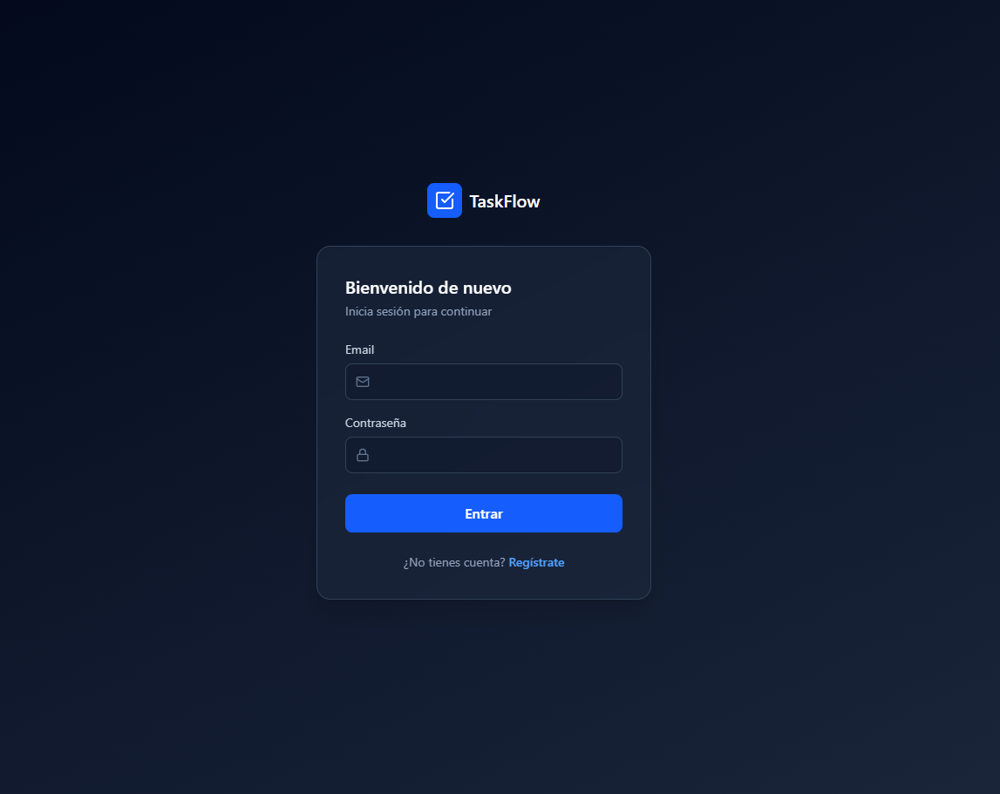
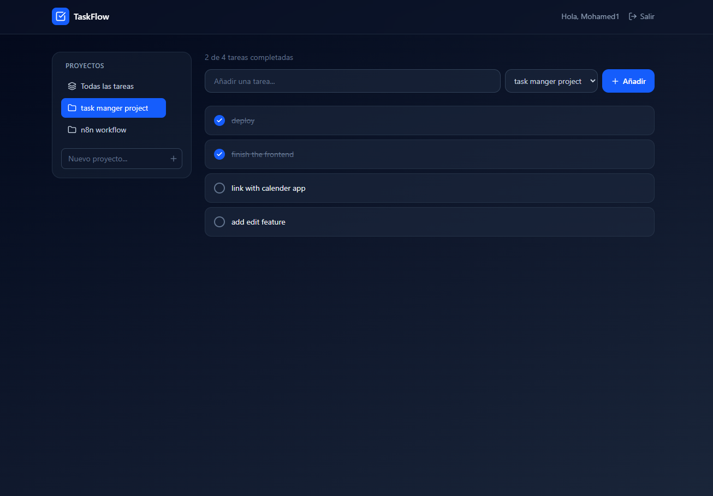

# Task Flow - Frontend

Interfaz para gestionar tareas y proyectos, conectada a una API REST propia.

## Demo en vivo
https://taskmanager-frontend-pearl.vercel.app

## Tecnologías
- React + Vite
- Tailwind CSS
- React Router
- Axios
- Desplegado en Vercel

## Funcionalidades
- Registro e inicio de sesión
- Sesión persistente (localStorage)
- Rutas protegidas
- Gestión de proyectos (crear, seleccionar, borrar)
- Gestión de tareas (crear, completar, borrar, filtrar por proyecto)

## Instalación local

bash
git clone https://github.com/mohamedkacem0/taskmanager-frontend.git
cd taskmanager-frontend
npm install

Crea un archivo `.env`:

VITE_API_URL=http://localhost:4000/api

bash
npm run dev

## Backend
https://github.com/mohamedkacem0/taskmanager-backend

## Capturas

### Login

### Dashboard

